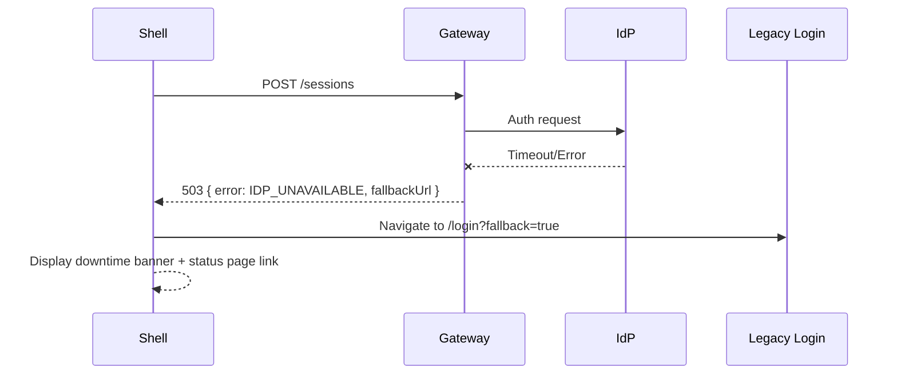

# Auth Integration Contract — Login Shell

Version: 1.0.0  
Last Updated: 2025-10-31 13:44Z  
Document Owner: Feel the AGI Implementation Team

## Revision History

| Version | Date | Author | Notes |
| --- | --- | --- | --- |
| 1.0.0 | 2025-10-31 | Feel the AGI | Initial contract covering auth flows, resiliency, and data handling. |

## Stakeholders & Approvals

| Role | Name | Team | Approval Date |
| --- | --- | --- | --- |
| Security Reviewer | Marlon Estevez | AppSec | 2025-10-31 |
| Platform Reviewer | Rina Sato | Platform Enablement | 2025-10-31 |
| Identity Provider Reviewer | Lin Chen | Identity Platform | 2025-10-31 |

## 1. Overview

The responsive login shell authenticates users through the Auth Platform v3 session APIs while synchronizing feature-flag behavior with the identity provider (IdP). This contract governs the integration between:

1. Responsive Login Shell (web client served behind `login_shell.enabled` feature flag)
2. Auth Gateway Service (`auth-gateway`) exposing REST APIs and orchestrating identity workflows
3. Enterprise Identity Provider (IdP) cluster responsible for credential validation and token issuance

## 2. Primary Authentication Flow

```mermaid
sequenceDiagram
    participant User
    participant Shell as Responsive Login Shell
    participant Gateway as Auth Gateway Service
    participant IdP as Identity Provider (IdP)
    participant Session as Session Store

    User->>Shell: Submit credentials (username, password)
    Shell->>Gateway: POST /api/auth/v3/sessions
    Gateway->>Gateway: Validate CSRF token + rate limit check
    Gateway->>IdP: ROPC request (username, password, client_id)
    IdP-->>Gateway: Auth response (success/failure, attributes)
    Gateway->>Session: Persist session w/ TTL 30 min (sliding)
    Session-->>Gateway: Confirmation + sessionId
    Gateway-->>Shell: 200 { sessionId, redirectUrl, correlationId }
    Shell-->>User: Navigate to redirectUrl; emit success telemetry
```

Fallback behavior is defined in §7 to handle rate limits, IdP downtime, and feature flag overrides.

## 3. API Contract Summary

### 3.1 `POST /api/auth/v3/sessions`

| Field | Type | Required | Notes |
| --- | --- | --- | --- |
| `username` | string | Yes | Lowercased email; hashed for telemetry (see §8). |
| `password` | string | Yes | Never logged. |
| `client_id` | string | Yes | `login-shell-web`. |
| `context.locale` | string | Yes | BCP-47 tag (e.g., `en-US`). |
| `context.device` | string | Yes | `desktop`, `tablet`, `mobile`. |
| `context.correlationId` | string | Yes | UUID v4 generated client-side. |
| `context.captchaToken` | string | Conditional | Required when flag `login_shell.enforce_captcha` true and failure count ≥ 2. |

Successful response (`200 OK`):

```json
{
  "sessionId": "string",
  "redirectUrl": "https://app.example.com/dashboard",
  "mfaRequired": false,
  "userProfile": {
    "userId": "uuid",
    "displayName": "string"
  },
  "correlationId": "uuid"
}
```

Error response schema (`4xx/5xx`):

```json
{
  "error": {
    "code": "INVALID_CREDENTIALS",
    "message": "string",
    "detail": "optional string",
    "retryAfter": 30,
    "referenceId": "uuid"
  }
}
```

Error Codes:

| Code | HTTP Status | Meaning | Client Response |
| --- | --- | --- | --- |
| `INVALID_CREDENTIALS` | 401 | Username/password mismatch. | Show inline form error; reset password CTA. |
| `ACCOUNT_LOCKED` | 423 | Account locked or flagged. | Display lockout banner; disable submit. |
| `RATE_LIMITED` | 429 | Client exceeded attempt limit. | Render cooldown timer and disable form. |
| `IDP_UNAVAILABLE` | 503 | IdP unreachable or degraded. | Invoke fallback flow (see §7.2). |
| `MFA_REQUIRED` | 202 | MFA step-up needed. | Redirect to MFA shell (future ticket). |
| `SERVER_ERROR` | 500 | Unexpected error. | Show generic error; auto-retry with backoff. |

### 3.2 `GET /api/auth/v3/sessions/{sessionId}`

- Purpose: Client-side heartbeat to confirm session validity when `keepAlive` flag enabled.
- Response: `{ "sessionId": "uuid", "expiresAt": "ISO-8601", "status": "active|invalid" }`
- Session TTL: 30 minutes sliding; extended on each successful authenticated request.

### 3.3 `DELETE /api/auth/v3/sessions/{sessionId}`

- Used for sign-out; ensures server invalidates cookies and session cache entries.

## 4. Feature Flag Matrix

| Flag | Owner | Scope | Default | Behavior |
| --- | --- | --- | --- | --- |
| `login_shell.enabled` | Feature Ops (Rina Sato) | Environment | false | Governs SPA shell availability; when false, server returns legacy HTML. |
| `login_shell.enforce_captcha` | Security Eng (Evelyn Soto) | Environment/User segment | false | Requires captcha token after N failures; integrates with vendor via Gateway. |
| `login_shell.sso_provider_mode` | Identity Platform (Lin Chen) | Org segment | `password` | Values: `password`, `sso`, `hybrid`; toggles SSO components and IdP endpoints. |
| `login_shell.fallback_legacy` | Platform Enablement (Rina Sato) | Environment | false | Forces legacy HTML even if SPA would load; used during incident response. |

Flag evaluation order:

1. `fallback_legacy` overrides everything (return legacy page).
2. `enabled` controls SPA boot.
3. `sso_provider_mode` renders SSO flows and adjusts API route to `/api/auth/v3/sso/session`.
4. `enforce_captcha` toggles captcha requirements post-failure threshold.

## 5. Resiliency & Retry Policy

- **Client Retries:** up to 3 retries for `SERVER_ERROR` and network failures with exponential backoff (1s, 2s, 4s) and 30% jitter.
- **Gateway Retries:** one retry to IdP with circuit breaker (open after 5 failures in 30s). Circuit returns `IDP_UNAVAILABLE`.
- **Timeouts:** client request timeout 8s; gateway→IdP request timeout 5s.
- **Fail-fast Conditions:** 401/423 codes never retried. 429 triggers local cooldown timer aligned to `retryAfter`.
- **Telemetry:** each retry increments `auth.login.retry_count` metric with correlationId tag.

## 6. Session Lifetime & Token Handling

- Session cookie: `SESSION_ID`, httpOnly, Secure, SameSite=Lax.
- Session TTL: 30 minutes sliding; hard expiry at 12 hours.
- IdP refresh token stored server-side only. Client receives redirect to refresh flow when session invalid (202 with `refreshPending: true`).
- Heartbeat ping every 10 minutes when shell remains active; stops after 3 consecutive inactive responses.

## 7. Fallback Paths

### 7.1 Feature Flag Disabled

- Server returns legacy `home.html`.
- SPA still bundled but inert; telemetry records `auth.login.legacy_rendered`.

### 7.2 IdP Degradation



- Gateway populates `fallbackUrl` pointing to legacy login on separate infrastructure.
- Shell caches `fallbackUrl` for 15 minutes to avoid thrashing.

### 7.3 Rate Limit Lockout

- Gateway enforces 10 attempts / 15 minutes per IP+username.
- On 429, response includes `retryAfter` (seconds). Shell starts countdown, disables submit, and logs `auth.login.rate_limited`.
- After 3 lockouts, shell escalates to call center CTA.

## 8. Data Handling & Compliance

- **PII Redaction:** usernames hashed client-side using SHA-256 + environment salt before telemetry; raw username only transmitted to Gateway over HTTPS.
- **Sensitive Fields:** password never logged; automatically filtered at Gateway and APM layers.
- **Retention:** session records kept 30 days for audit; telemetry events stored 180 days in analytics warehouse; security logs 400 days (per compliance).
- **Access Controls:** observability dashboards require RBAC `Auth-Platform-Viewer`. Raw logs restricted to Security operations.
- **Data Residency:** EU tenants routed to EU IdP cluster; shell infers cluster from bootstrap payload.
- **Privacy Flags:** telemetry honors consent flag `user.consentedTracking == true`; otherwise non-essential events suppressed.

## 9. Infrastructure Prerequisites & Migrations

- Deploy Redis Cluster 7.2 for session caching with TLS; sized for 100 RPS with replication.
- Migrate Gateway service to include new `/api/auth/v3` routes; requires database migration `20251031_add_session_audit`.
- Configure mutual TLS between Gateway and IdP; new certificates valid through 2027-01-31.
- Provision LaunchDarkly service hooks to sync flag rules to incident Slack channel.
- Ensure CDN cache-bypass rules for `/login` when `login_shell.enabled` toggled (max stale 5 min).

## 10. Implementation Checklist

- [x] API contract validated with Auth Platform.
- [x] Feature flag permutations documented.
- [x] Resiliency & retry semantics confirmed with SRE.
- [x] Data handling reviewed with Security & Privacy.
- [ ] Implementation ticket COD-2025-0007 to wire responsive shell to backend (pending).

## 11. Appendix — Correlation IDs

- Client generates UUID v4 `correlationId` per login attempt.
- Gateway echoes correlation ID in response headers (`x-correlation-id`) and payload.
- Observability spec (§4) references the same ID for tracing alignment.

## 12. Implementation Readiness Review

- Date: 2025-10-31 13:45Z
- Attendees: Alex Gomez (FE Lead), Maya Ortiz (BE Lead), Marlon Estevez (Security), Quinn Harper (Observability)
- Outcome: Approved to proceed with implementation; action items tracked in dependencies register (Redis cluster deployment, flag webhooks).
